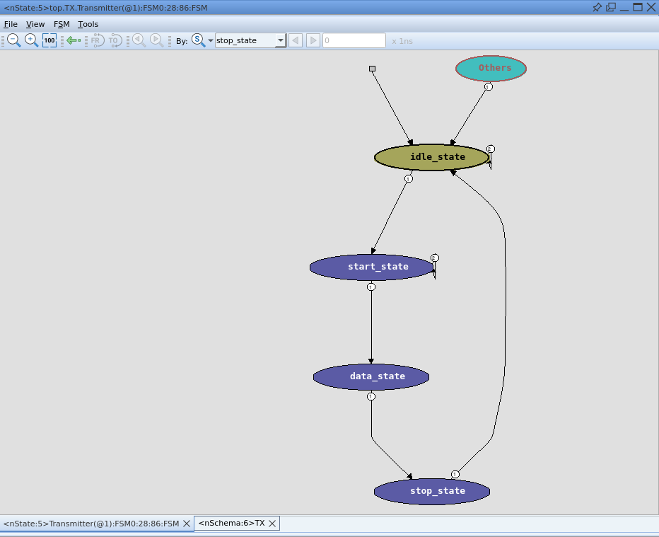
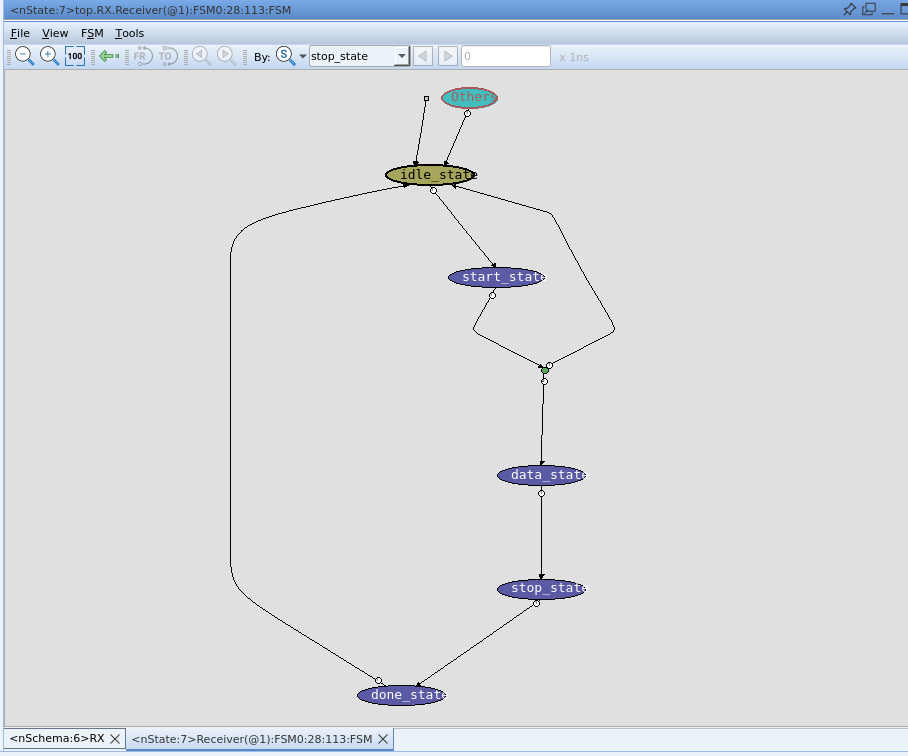
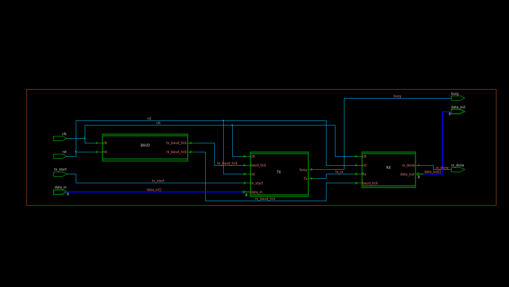
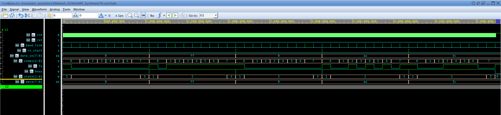
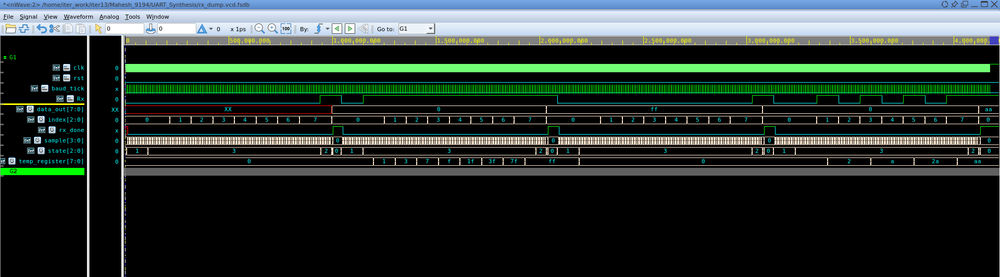
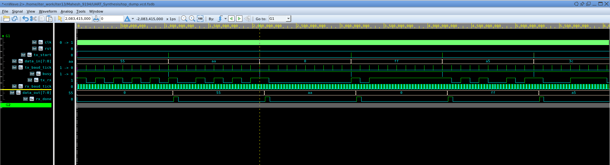
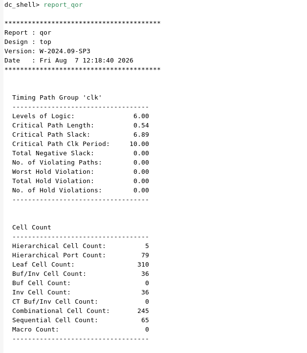
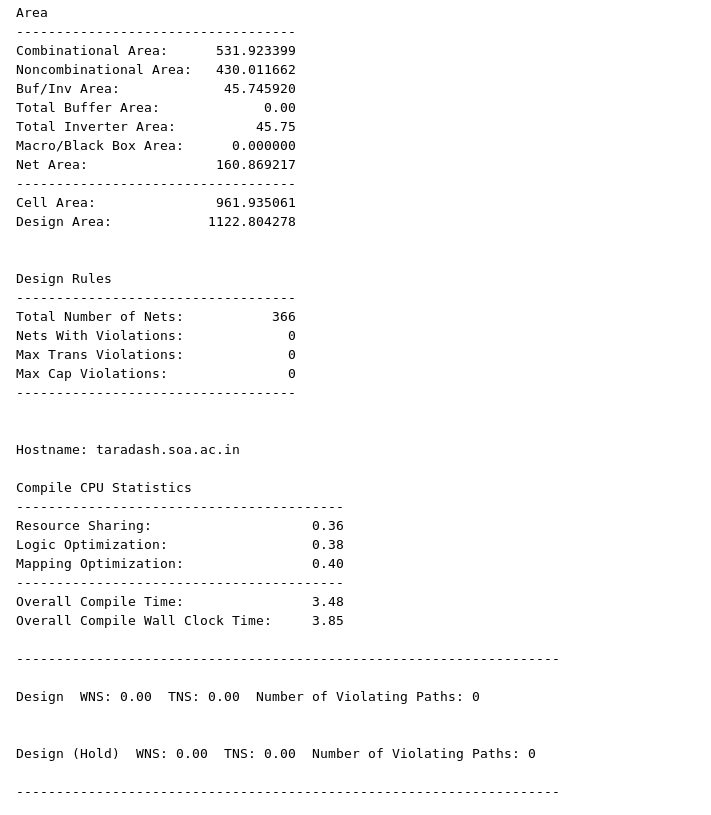

# 🚀 UART Design, UVM Verification, and Synthesis

> **Author:** Mahesh Kumar Sahoo
> **Project Source:** MAHESH_UART_UVM_REPORT.pdf

Welcome to the Universal Asynchronous Receiver Transmitter (UART) project repository! This project demonstrates the end-to-end RTL design, loopback verification, and ASIC logic synthesis of a UART architecture.

## 🧰 EDA Tools Used
* **RTL Simulation & UVM Verification:** Synopsys VCS
* **Waveform Viewing & Debugging:** Synopsys Verdi
* **ASIC Logic Synthesis & Timing Analysis:** Synopsys Design Compiler

## 📖 Introduction
The Universal Asynchronous Receiver-Transmitter (UART) is a fundamental hardware communication protocol used for serial data exchange between two devices. 
* **Simplicity:** It requires only two wires for bidirectional communication (TX and RX) and eliminates the need for a shared clock line.
* **How it works:** Devices operate using their local clocks and agree on a predefined baud rate. 
* **Applications:** Widely used in embedded systems, debugging (e.g., Arduino to PC via USB-to-UART), GPS receivers, and wireless modules like the Bluetooth HC-05.

## ⚙️ Working
The UART architecture does not share a common clock signal between devices, making it fundamentally asynchronous. Devices must communicate at an identical baud rate. The architecture is divided into the following key modules:

### 1. Baud Rate Generator ⏱️
* Acts as the timing synchronizer for the protocol.
* Calculates required counter states from the input clock frequency and baudrate parameters.
* Generates a baud tick for the Transmitter and Receiver. The receiver baud tick is oversampled 16 times to ensure glitch-free reception.

### 2. Transmitter (TX) 📤
* Converts parallel 8-bit input data into a serial bitstream.
* Uses a 4-state Finite State Machine (FSM): **Idle**, **Start**, **Data** (sends bits sequentially), and **Stop**.
* Outputs a `busy` flag to prevent data overwrite during transmission.

*Caption: Figure 1 - State machine diagram detailing the operational states of the UART Transmitter.*

### 3. Receiver (RX) 📥
* Captures serial data from the RX line and converts it back to 8-bit parallel output.
* Uses 16x oversampling and samples the bit exactly at the midpoint (sample == 7) to reject noise.
* Uses a 5-state FSM: **Idle**, **Start**, **Data**, **Stop**, and **Done**.

*Caption: Figure 2 - State machine diagram detailing the 16x oversampling states of the UART Receiver.*

### 4. Top Module 🧩
* Integrates the Baud Rate Generator, TX, and RX modules.
* Features an internal loopback connection (`tx_rx`) that feeds the transmitted data directly into the receiver.

*Caption: Figure 3 - Top-level block diagram integrating the TX, RX, and Baud Rate Generator with loopback configuration.*

## 🛠️ UVM Verification
The design was extensively verified using a Universal Verification Methodology (UVM) environment, simulated with Synopsys VCS and Verdi. 

* **Components:** The UVM testbench includes standard verification components such as the Interface (`uart_intf`), Sequence, Driver, Monitor, Agent, Scoreboard, and Environment.
* **Scoreboard Logic:** The Scoreboard continuously fetches and compares transactions. It validates the received `data_out` against the expected `data_in` and prints out a detailed report of matched vs. mismatched test cases.

*Caption: Figure 4 - UVM Scoreboard terminal output validating transactions and displaying final test results.*

## 📊 Output
The design successfully serialized, transmitted, received, and deserialized the data frames. 

### 🌊 Simulation Waveforms

*Caption: Figure 5 - Simulation waveform verifying the clock division and tick generation of the Baud Rate Generator.*

*Caption: Figure 6 - Simulation waveform demonstrating parallel-to-serial conversion during UART transmission.*

*Caption: Figure 7 - Simulation waveform demonstrating serial-to-parallel deserialization during UART reception.*

*Caption: Figure 8 - Simulation waveform of the integrated UART top module verifying the internal TX-to-RX loopback.*

### 🔬 Synthesis & Static Timing Analysis
The ASIC synthesis workflow used the Synopsys Design Compiler with the 32nm SAED32 standard cell library. 
* **Timing Closure:** Achieved setup timing closure with a positive slack of **6.89 ns** (under a 10 ns clock period, zero violating paths).
* **Cell Area:** **1122.80 µm²**.
* **Power Dissipation:** **58.20 µW**.

*Caption: Figure 9 - Synopsys Design Compiler Quality of Results (QoR) reports detailing total cell area and power dissipation.*

*Caption: Figure 10 - Static Timing Analysis (STA) report confirming zero timing violations and a positive setup slack of 6.89 ns.*

## 🎯 Conclusion
The project successfully completed the RTL design, UVM loopback verification, and ASIC logic synthesis of a UART. A key achievement was implementing the 16x oversampling mechanism for noise-tolerant asynchronous communication. 

**Future Enhancements:**
* Adding configurable parity bit generation/checking for error detection.
* Supporting multi-bit stop configurations and variable payloads.
* Integrating 16-byte hardware FIFO buffers for RX/TX queues to reduce CPU interrupts.
* Wrapping the module with AMBA APB or AXI-Lite bus protocols for SoC integration.
